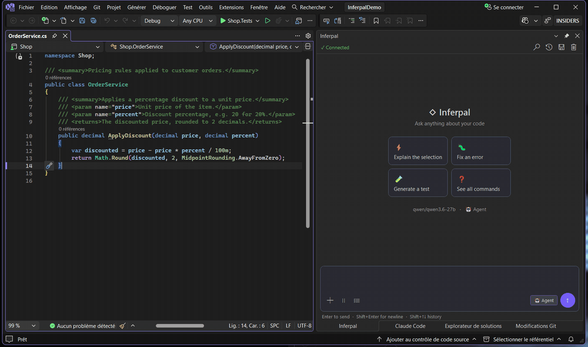

<p align="center">
  
</p>

<h1 align="center">Inferpal</h1>

<p align="center">
  An agentic developer assistant for Visual Studio 2022/2026 and
  <b>VS Code</b> — powered entirely by <b>local LLMs</b>: Ollama, LM Studio,
  or any OpenAI-compatible server. Full tool calling, inline ghost-text completions,
  semantic codebase search, and zero required cloud dependency.
</p>

<p align="center">
  <a href="https://github.com/EstaxNet/Inferpal/actions/workflows/ci.yml"></a>
  <a href="https://github.com/EstaxNet/Inferpal/releases/latest"></a>
  <a href="https://www.gnu.org/licenses/gpl-3.0"></a>
  
  
  
  
</p>

<p align="center">
  <a href="https://github.com/EstaxNet/Inferpal/releases/latest"><b>⬇ Download the latest release</b></a>
  — <code>Inferpal-vs2026-*.vsix</code> for Visual Studio (double-click to install)
  or <code>inferpal-vscode-win32-x64-*.vsix</code> for VS Code.
  Visual Studio Marketplace listing coming soon.
</p>

<p align="center">
  
</p>

---

## What is Inferpal?

Inferpal turns a local model into a fully agentic coding assistant living inside your IDE.
The model autonomously chains tool calls — reading and writing files, running commands,
building, testing, and searching your codebase — to complete real tasks, while every write
and every command stays behind an approval gate and a workspace sandbox. No API key, no
telemetry, no cloud required.

It ships as a **Visual Studio 2022/2026 extension** (the primary target) and a
**VS Code extension** at feature parity since 1.2.0 — one shared engine (`Inferpal.Core`),
two editors.

### Highlights

- **Agentic loop** — 28 built-in tools, plus user-defined shell tools and **MCP** servers; independent read-only tools run in parallel.
- **Local-first** — Ollama, LM Studio, or any OpenAI-compatible server (llama.cpp, vLLM); run the backend locally or on a [remote GPU host](docs/remote-inference.md).
- **Inline ghost-text completions** — Fill-in-the-Middle as you type (Tab / Esc), with Fast / Default / High-Accuracy presets.
- **Semantic codebase search** — background indexing with hybrid retrieval (cosine + BM25 fused with RRF) and per-turn auto-context.
- **Smart Fix Protocol** — after every edit, a polyglot build/typecheck (.NET / TypeScript / Rust / Go) feeds compile errors back so the agent fixes them in the same loop.
- **Code actions & Inline Edit** — Explain / Fix / Refactor / Add Tests / Add Docstring, plus **Ctrl+Shift+I** to rewrite a selection in place.
- **Safety by default** — approval-gated writes/commands, a catastrophic-command hard denylist, force-prompt on indirect execution (`iex`, `-EncodedCommand`, …) **and on anything a cloned repository authored** (committed validators, permission overlays), committable permission rules, and a hardened SSRF guard.
- **Governance & knowledge** — repo-versioned `.inferpal/rules` & AI checks, `@Docs` external-doc indexing, typed `@`-mentions, and 50+ slash commands.
- **Built for the IDE** — live debugger awareness, VRAM monitoring, VS theme adaptation, and 10 UI languages.
- **Debugger loop** — `/debug [goal]` lets the agent drive a **real debug session** from the chat: breakpoints, stepping, locals and call-stack inspection, in both editors (Visual Studio via an in-process driver, VS Code via a DAP bridge). Read-only, and starting a session always asks first.
- **Compiler-backed code intelligence** — `analyze_impact`, `analyze_code` and `rename_symbol` resolve C# symbols with the Roslyn compiler instead of name matching: real references, not homonyms — and `rename_symbol` no longer rewrites unrelated tokens that merely share the name.
- **Anchored diff review** — `/check` reviews your pending diff against repo-versioned AI checks and anchors every finding to a diff line (and says so when a location can't be confirmed); `/commit` drafts the message, `/commit-exec` runs it only after you've read it.
- **Persistent plans** — `/plan save|list|next|done` turns the current plan into a committable markdown file under `.inferpal/plans/` that survives `/clear`, restarts and editors; a plan can never execute anything by itself.
- **Background agent tasks** — `/task [goal]` runs a read-only agent while you keep coding (serial queue behind the GPU scheduler); `/task propose` records the writes it *would* make, and `/task apply` replays each one through the normal approval prompt — never granted in advance.
- **Project onboarding** — a committable, non-privileged `.inferpal/project.json` profile plus `/onboard` (report, apply model-role recommendations, generate the project context file). Classified by allow-list: unknown keys are ignored, never interpreted.
- **Multi-model toolkit** — `/bench` scores your installed models per role, `/arena` runs blind A/B duels, and the **Model Router** sends background tasks (titles, commit messages, summaries) to a small utility model — never cold-loading one.
- **Conversation branching** — `/branch <n>` forks a conversation at any turn: the branch keeps turns 1..*n* and the conversation continues there, while the original is written back to disk first. `/branch` lists the branch points and the family tree, `/branch <name>` switches. Branches are plain session files, so nothing else had to learn about them.
- **Transparency** — the **Context X-Ray** panel breaks down the exact prompt sent to the model, layer by layer, with per-layer toggles; `/replay` reconstructs an agent run post-mortem; `/fix` `/refactor` `/doc` show a per-hunk **inline diff preview** before touching your buffer.
- **VS Code at parity** — the same chat (markdown, tool bubbles, plan display, typed `@`-mentions, slash commands with autocomplete), the same settings, the same approvals and inline FIM completions, backed by a bundled self-contained host (no .NET install needed).

> See **[docs/features.md](docs/features.md)** for the full functional tour.

---

## Requirements

| Requirement | Details |
|---|---|
| Editor | Visual Studio 2022 (17.9+) **or** 2026 (18.x) — Community / Professional / Enterprise — or **VS Code** (preview, win32-x64) |
| .NET SDK | .NET 8 (building from source only — the VS Code VSIX bundles its own runtime) |
| Model server | [Ollama](https://ollama.com) (default — full hardware-aware features), [LM Studio](https://lmstudio.ai), or any **OpenAI-compatible** server, local or [remote](docs/remote-inference.md) |

> Tool calling is required (e.g. `llama3.1`, `qwen2.5-coder`, `mistral-nemo`; `llama3` v1 does not).
> Inline completions need a FIM model; semantic search works best with a dedicated embedding model.

---

## Quick Start

1. Download the extension from **[the latest release](https://github.com/EstaxNet/Inferpal/releases/latest)**:
   - **Visual Studio**: double-click `Inferpal-vs2026-<version>.vsix`;
   - **VS Code (preview)**: `code --install-extension inferpal-vscode-win32-x64-<version>.vsix`
     (or Extensions view → `…` → *Install from VSIX…*);
   - or build from source: `dotnet build Inferpal/Inferpal.csproj` — see [Development](docs/development.md).
2. Start a model server:

   ```powershell
   ollama serve          # LM Studio / any OpenAI-compatible server also work
   ollama pull llama3.1
   ```

3. In Visual Studio open **Tools → Inferpal** (or **Alt+B** / **Alt+O**); in VS Code, open the **Inferpal** view in the Activity Bar.
4. Open **Inferpal Settings**, pick the provider, set the server URL, select a model, click **Test**, then start chatting. (Both editors share the same Inferpal configuration.)

Full walkthrough: **[Getting Started](docs/getting-started.md)**.

---

## Documentation

Complete functional and technical documentation lives in **[`docs/`](docs/README.md)**.

| Functional | Technical |
|---|---|
| [Getting Started](docs/getting-started.md) · [Providers](docs/providers.md) · [Configuration](docs/configuration.md) | [Architecture](docs/architecture.md) |
| [Features](docs/features.md) · [Slash Commands](docs/slash-commands.md) · [Tools](docs/tools.md) · [Mentions](docs/mentions.md) | [Development](docs/development.md) |
| [Search & Indexing](docs/search-and-indexing.md) · [MCP](docs/mcp.md) · [Rules & Checks](docs/rules-and-checks.md) · [Remote Inference](docs/remote-inference.md) | |

---

## Contributing

Contributions are welcome — see **[Development](docs/development.md)** for the build, the
project layout, and how to add a tool or a language. Quick version: implement `ITool`,
register it in `ToolRegistry.cs`, and add any new strings to all 10 `.resx` files **and** to
`Strings.cs`.

---

## License

Licensed under the [GNU GPL v3](https://www.gnu.org/licenses/gpl-3.0).

## Acknowledgments

Developed with the assistance of **Claude Opus 4.8** (Anthropic).
