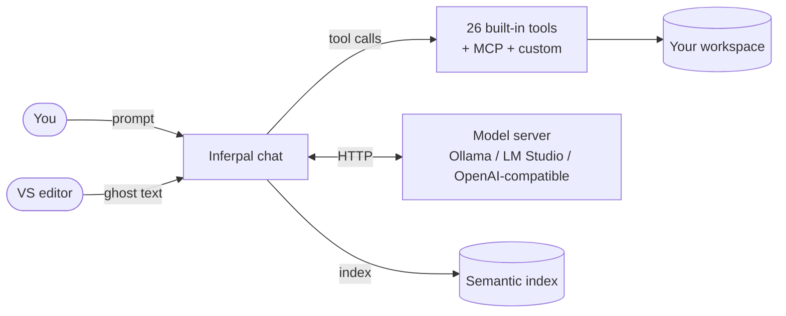

  

# Inferpal Documentation

Inferpal is a Visual Studio 2022/2026 extension that turns a **local LLM** — served by
[Ollama](https://ollama.com), [LM Studio](https://lmstudio.ai), or any OpenAI-compatible
server — into an **agentic developer assistant** with tool calling, inline completions,
semantic codebase search, and zero required cloud dependency.

This folder is the full documentation set, split into **functional** guides (how to use it)
and **technical** references (how it works).

> [!TIP]
> New here? Start with **[Getting Started](getting-started.md)**, then skim the
> **[Features](features.md)** overview.

## Overview

## Functional guides

| Guide | What it covers |
|---|---|
| [Getting Started](getting-started.md) | Install a backend, build & install the extension, first run |
| [Providers](providers.md) | Ollama / LM Studio / OpenAI-compatible — capabilities and setup |
| [Configuration](configuration.md) | Every setting and config key, with defaults |
| [Features](features.md) | Functional tour of everything Inferpal does |
| [Slash Commands](slash-commands.md) | The full `/command` reference |
| [Tools](tools.md) | The 26 built-in agent tools, custom shell tools, permission rules, and the approval model |
| [Mentions](mentions.md) | The `@` typed-context picker |
| [Search & Indexing](search-and-indexing.md) | Semantic codebase search (RAG) and `@Docs` external documentation |
| [MCP](mcp.md) | Connecting Model Context Protocol servers |
| [Rules & AI Checks](rules-and-checks.md) | Repo-versioned governance (`.inferpal/rules`, `.inferpal/checks`) |
| [Remote Inference](remote-inference.md) | Run the model server on another machine |

## Technical references

| Reference | What it covers |
|---|---|
| [Architecture](architecture.md) | Process model, IPC boundary, services, data flow, GPU scheduling |
| [Development](development.md) | Build, test, project layout, adding tools/languages, contributing |

## Quick facts

| | |
|---|---|
| Visual Studio | 2022 (17.9+) or 2026 (18.x) — Community / Professional / Enterprise |
| Runtime | .NET 8 (`net8.0-windows`) |
| Extension model | `Microsoft.VisualStudio.Extensibility.Sdk` 17.14.x (out-of-process) + in-process MEF for ghost text |
| Built-in tools | 25 (+ MCP servers + user shell tools) |
| Languages (UI) | 10 |
| Tests | 662 xUnit tests |
