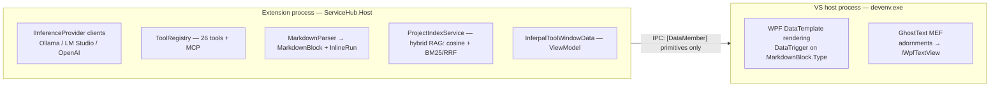
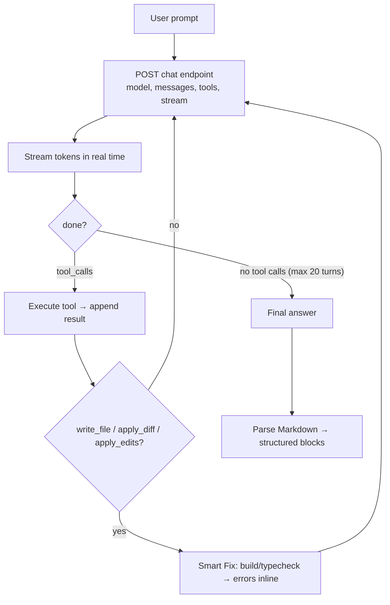

# Architecture

This page describes how Inferpal is put together. For build/test/contribution mechanics see
**[Development](development.md)**.

## Process model

Inferpal uses the **out-of-process** Visual Studio Extensibility model
(`Microsoft.VisualStudio.Extensibility.Sdk` 17.14.x). A hard constraint of VS Remote UI:
only types loaded in `devenv.exe` can be referenced in XAML. The out-of-process parts run in
a `ServiceHub.Host` process, so all data crossing the boundary must be `[DataContract]`
objects containing **only primitives** (and collections of such).



### In-process ghost text

Inline completions need `IWpfTextView`, which is not available to out-of-process extensions.
The `GhostText` components are therefore **in-process**: MEF parts
(`IWpfTextViewCreationListener`, `AdornmentLayerDefinition`) plus a minimal `AsyncPackage`
that forces Visual Studio to load `Inferpal.dll` inside `devenv.exe`. They ship in the **same
VSIX and assembly** as the out-of-process extension but run in `devenv.exe`.

## Agentic loop



The chat endpoint is provider-specific (`/api/chat` for Ollama, `/v1/chat/completions` for
OpenAI-compatible); the loop logic is identical. `RunAgentAsync` never throws on network
errors — it converts them into a result; only cancellation propagates.

## System prompt layering

`BuildSystemPrompt()` assembles the prompt in this order at the start of each conversation:

```
[Base prompt]          ← hardcoded in the extension
[Custom system prompt] ← Settings (optional)
[Pinned files]         ← up to 3 pinned context files (optional)
[## Project context]   ← .inferpal/context.md (optional)
[## Agent memory]      ← .inferpal/memory.md (optional)
[## Project notes]     ← .inferpal/notes.md (optional)
[## Rules]             ← .inferpal/rules/*.md matching the active file (optional)
```

It is rebuilt on `/clear`, on session load, and when the active editor file changes (so
glob-scoped rules and the persona re-scope automatically).

## GPU scheduling

Chat, ghost-text FIM, and RAG/@Docs embeddings can all target one backend on one GPU.
Without coordination a steady stream of background embeddings can starve the chat model and
the request times out. A central scheduler enforces priority **chat > FIM > embedding**:

- A chat/agent run acquires a **lease** (`GpuScheduler`) for its whole duration — this covers
  chat, commit/title generation, synthesis, plan, and code actions.
- Background embedding loops (`ProjectIndexService`, `DocsIndexService`) `await
  WaitForChatIdleAsync` — they pause without losing progress and resume immediately.
- Inline completions run in `devenv.exe`, so they coordinate cross-process via a
  `ChatBusySignal` file (`%TEMP%/Inferpal/chat_busy.json`, pid + timestamp, anti-stale): FIM
  is skipped while the chat is busy.

> [!WARNING]
> **Query** embeddings (`search_codebase`, `search_docs`) are never gated — the agent holding
> the lease would otherwise deadlock on its own embedding. Only background **indexing** loops
> wait.

## Rendering & theming

- **Markdown**: `MarkdownParser` (Markdig 1.2.0) parses assistant text into a
  `List<MarkdownBlock>` (stripping `<think>…</think>`), propagated as `[DataMember]` to
  `devenv.exe` and rendered by `DataTrigger` on `MarkdownBlock.Type` (paragraph/lists →
  `WrapPanel`, headings → `TextBlock`, `code_block` → read-only `TextBox`, separator →
  `Border`).
- **Theme**: detected from VS settings and propagated VM → `ChatMessageItem` → `MarkdownBlock`
  → `InlineRun` as plain `[DataMember]` color strings (Remote UI does not propagate via
  `ElementName` across nested `DataTemplate`s). Colors are centralized in `ThemePalette`.

## Cross-process signals

The in-process package publishes state the out-of-process agent reads via small file-based
IPC channels:

| Signal | Direction | Purpose |
|---|---|---|
| `ChatBusySignal` | host → devenv | FIM yields to an active chat |
| `DebuggerStateSignal` | devenv → host | `VsDebuggerTracker` publishes the break state for `get_debugger_state` / `@debugger` |
| `BuildSignalFile` | devenv → host | `VsBuildMonitor` surfaces VS build failures as the "Build Failed" banner |

## Tech stack

| Component | Technology |
|---|---|
| Language / runtime | C# .NET 8 (`net8.0-windows`) |
| Extension SDK | `Microsoft.VisualStudio.Extensibility.Sdk` 17.14.40608 (out-of-process) |
| In-process MEF | `Microsoft.VisualStudio.Shell.15.0`, `Microsoft.VisualStudio.Text.UI.Wpf` |
| Markdown | Markdig 1.2.0 |
| Vector store | SQLite WAL (`Microsoft.Data.Sqlite` 8.0.16) |
| C# analysis | `Microsoft.CodeAnalysis.CSharp` 4.14.0 (Roslyn) |
| MCP client | Home-grown JSON-RPC 2.0 over stdio (zero extra dependencies) |
