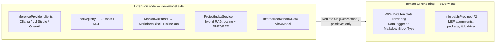
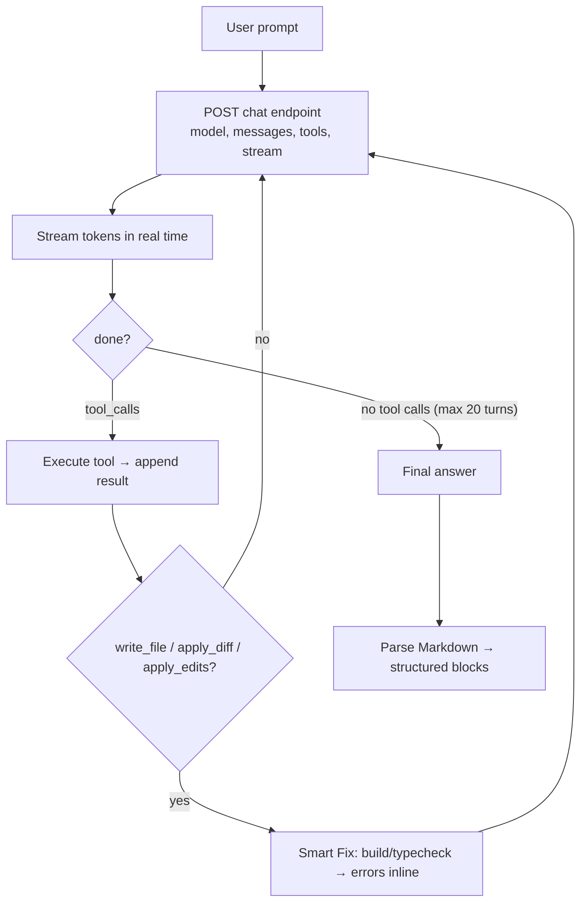

# Architecture

This page describes how Inferpal is put together. For build/test/contribution mechanics see
**[Development](development.md)**.

## Two front-ends, one engine

All the logic — providers, tools, agent orchestrator, RAG, MCP, localization — lives in
**`Inferpal.Core`**, a plain `net8.0` class library with **zero editor-SDK or WPF
dependency** (enforced by `CoreIsolationTests`). Editor access goes through ports:
`IEditorSurface` for the editor surface and `ApprovalServiceBase` for the approval
pipeline.

Two adapters consume it:

- **Visual Studio** (`Inferpal/` + `Inferpal.InProc/` + `Inferpal.Fim/`) — the primary target,
  described in the rest of this page (`VsEditorSurface`, `VsApprovalService`, Remote UI tool
  window, and everything that must live inside `devenv.exe`).
- **VS Code** (`vscode/` + `Inferpal.Host/`, at feature parity since 1.2.0) — `Inferpal.Host` is a console
  process hosting the Core behind **header-framed JSON-RPC on stdio** (`initialize`,
  `chat/send` with streamed notifications, `models/list`, `fim/complete`, `textDocument/did*`
  sync…), with reverse ports `RpcEditorSurface` and `RpcApprovalService` (fail-closed). The
  TypeScript extension spawns and supervises it, renders the sidebar webview chat, and feeds
  dirty buffers through `OpenDocumentOverlay` so `read_file` sees unsaved edits.

## Process model

Inferpal uses the Visual Studio Extensibility model
(`Microsoft.VisualStudio.Extensibility.Sdk` 17.14.x), hosted **in-process** since 2026-08-23
(`RequiresInProcessHosting` + `VssdkCompatibleExtension`) — the only documented way to ship the
in-process parts below alongside it. A hard constraint of VS Remote UI:
only types loaded in `devenv.exe` can be referenced in XAML, so all data crossing the
view-model boundary must be `[DataContract]` objects containing **only primitives** (and
collections of such). That rule comes from the SDK and holds under in-process hosting too.


```mermaid
flowchart LR
    subgraph host["Extension code — view-model side"]
        prov[IInferenceProvider clients<br/>Ollama / LM Studio / OpenAI]
        reg[ToolRegistry — 28 tools + MCP]
        md[MarkdownParser → MarkdownBlock + InlineRun]
        rag[ProjectIndexService — hybrid RAG: cosine + BM25/RRF]
        vm[InferpalToolWindowData — ViewModel]
    end
    subgraph dev["Remote UI rendering — devenv.exe"]
        wpf[WPF DataTemplate rendering<br/>DataTrigger on MarkdownBlock.Type]
        ghost[Inferpal.InProc net472<br/>MEF adornments, package, /tdd driver]
    end
    host -- "Remote UI: [DataMember] primitives only" --> dev
```

### The in-process half — `Inferpal.InProc` (net472) and its `Inferpal.Fim` sidecar

Some features cannot be served from outside the editor: inline completions need
`IWpfTextView`, the inline-diff preview needs an adornment layer, and the `/tdd` debugger
capture needs EnvDTE. Everything in that category lives in **`Inferpal.InProc`** — MEF parts
(`IWpfTextViewCreationListener`, `AdornmentLayerDefinition`), a minimal `AsyncPackage`, the
solution/debugger/build trackers and the chat auto-scroller.

**It is a separate assembly, and it targets `net472`.** `devenv.exe` is a .NET Framework 4.7.2
process, and its MEF discovery reflects over the assembly declared as an asset: a .NET 8
assembly has a reference closure the Framework cannot resolve, so every one of our types is
rejected — silently. Since 1.6.0 the shipped in-process assembly is therefore
`Inferpal.InProc.dll`, never `Inferpal.dll`.

It does **not** reference `Inferpal.Core`. What it shares with the Core it shares **in source**
(`<Compile Link>`: the signal bus, `Diagnostics`, the debugger DTOs, `RetryGate`), so the two
ends of a file channel cannot drift apart. Inference lives in the Core, so completions are
served by **`Inferpal.Fim`**, a small net8 console the in-process half starts on demand and
talks to over the same header-framed JSON-RPC grammar as `Inferpal.Host`. The sidecar *is* the
Core — no backend logic is duplicated. It is recycled when `config.json` changes, killed when
the package is disposed, and dies with `devenv` anyway (its stdin closes).

Visual Studio only inventories the in-process half through the `MefComponent` / `VsPackage`
assets of the packaged manifest, and only when that manifest declares the hybrid installation
type `ExtensionType="VSSDK+VisualStudio.Extensibility"` — with the out-of-process type alone the
VSIX lands in `Common7\IDE\VSExtensions\` and nobody processes its assets. Miss any of these
and the components load nowhere and nothing says so: the chat is out-of-process and keeps
working. That silence is why the in-process half publishes a heartbeat per load door
(`InProcAliveSignal`) and why `/diagnostics` reports which one is missing.

## Agentic loop


```mermaid
flowchart TD
    p[User prompt] --> req[POST chat endpoint<br/>model, messages, tools, stream]
    req --> stream[Stream tokens in real time]
    stream --> done{done?}
    done -- "tool_calls" --> exec[Execute tool → append result]
    exec --> smart{write_file / apply_diff / apply_edits?}
    smart -- yes --> fix[Smart Fix: build/typecheck → errors inline]
    fix --> req
    smart -- no --> req
    done -- "no tool calls (max 20 turns)" --> final[Final answer]
    final --> render[Parse Markdown → structured blocks]
```

The chat endpoint is provider-specific (`/api/chat` for Ollama, `/v1/chat/completions` for
OpenAI-compatible); the loop logic is identical. `RunAgentAsync` never throws on network
errors — it converts them into a result; only cancellation propagates.

## System prompt layering

`BuildSystemPrompt()` assembles the prompt in this order at the start of each conversation:

```
[Base prompt]          ← hardcoded in the extension
[Custom system prompt] ← Settings (optional)
[Pinned files]         ← up to 3 pinned context files (optional)
[## Project context]   ← .inferpal/context.md (optional)
[## Agent memory]      ← .inferpal/memory.md (optional)
[## Project notes]     ← .inferpal/notes.md (optional)
[## Rules]             ← .inferpal/rules/*.md matching the active file (optional)
```

It is rebuilt on `/clear`, on session load, and when the active editor file changes (so
glob-scoped rules and the persona re-scope automatically).

## GPU scheduling

Chat, ghost-text FIM, and RAG/@Docs embeddings can all target one backend on one GPU.
Without coordination a steady stream of background embeddings can starve the chat model and
the request times out. A central scheduler enforces priority **chat > FIM > embedding**:

- A chat/agent run acquires a **lease** (`GpuScheduler`) for its whole duration — this covers
  chat, commit/title generation, synthesis, plan, and code actions.
- Background embedding loops (`ProjectIndexService`, `DocsIndexService`) `await
  WaitForChatIdleAsync` — they pause without losing progress and resume immediately.
- Inline completions run in `devenv.exe`, so they coordinate cross-process via `ChatBusySignal`
  markers (`%TEMP%/Inferpal/chat_busy.<pid>.json`, **one file per writer** — pid + timestamp,
  anti-stale, periodically re-stamped during long runs): FIM is skipped while *any* live marker
  is fresh. Each writer only ever deletes its own marker, so the first chat to finish cannot
  silence another's. A legacy unscoped `chat_busy.json` from an older version is still honoured
  read-only, never written or deleted.

> [!WARNING]
> **Query** embeddings (`search_codebase`, `search_docs`) are never gated — the agent holding
> the lease would otherwise deadlock on its own embedding. Only background **indexing** loops
> wait.

## Rendering & theming

- **Markdown**: `MarkdownParser` (Markdig 1.2.0) parses assistant text into a
  `List<MarkdownBlock>` (stripping `<think>…</think>`), propagated as `[DataMember]` to
  `devenv.exe` and rendered by `DataTrigger` on `MarkdownBlock.Type` (paragraph/lists →
  `WrapPanel`, headings → `TextBlock`, `code_block` → read-only `TextBox`, separator →
  `Border`).
- **Theme**: detected from VS settings and propagated VM → `ChatMessageItem` → `MarkdownBlock`
  → `InlineRun` as plain `[DataMember]` color strings (Remote UI does not propagate via
  `ElementName` across nested `DataTemplate`s). Colors are centralized in `ThemePalette`.

## Cross-process signals

The in-process package publishes state the agent reads via small file-based
IPC channels:

| Signal | Direction | Scope | Purpose |
|---|---|---|---|
| `ChatBusySignal` | host → devenv | machine-wide, one marker file per writer | FIM yields to an active chat anywhere on the box (one GPU) |
| `DebuggerStateSignal` | devenv → host | per VS instance (`<name>.<devenv pid>.json`) | `VsDebuggerTracker` publishes the break state for `get_debugger_state` / `@debugger` |
| `DebugCommandSignal` | host → devenv | per VS instance (`<name>.<devenv pid>.json`) | carries `/debug` operations (breakpoints, step, continue…) to the in-process EnvDTE driver |
| `BuildSignalFile` | devenv → host | per VS instance (`<name>.<devenv pid>.json`) | `VsBuildMonitor` surfaces VS build failures as the "Build Failed" banner |
| `ActiveSolutionSignal` | devenv → host | per VS instance (`<name>.<devenv pid>.json`) | authoritative open-solution root for `/solution`, `/map`, RAG |
| `InlineDiffPreviewSignal` | host → devenv | per VS instance (`<name>.<devenv pid>.json`) | carries inline-diff preview requests to the in-editor renderer |

Per-instance channels key their file names on the devenv PID (the in-process package declares
its own PID; the extensibility host declares its parent PID after checking the parent is
`devenv`), so two VS instances never read each other's state. A process that declared no key
keeps the legacy unscoped names; a host with no in-process peer (VS Code) does not read the
per-instance channels at all.

## Tech stack

| Component | Technology |
|---|---|
| Language / runtime | C# .NET 8 (`net8.0-windows`) |
| Extension SDK | `Microsoft.VisualStudio.Extensibility.Sdk` 17.14.40608 (in-process hosting) |
| In-process MEF | `Microsoft.VisualStudio.Shell.15.0`, `Microsoft.VisualStudio.Text.UI.Wpf` |
| Markdown | Markdig 1.2.0 |
| Vector store | SQLite WAL (`Microsoft.Data.Sqlite` 8.0.16) |
| C# analysis | `Microsoft.CodeAnalysis.CSharp` 4.14.0 (Roslyn) |
| MCP client | Home-grown JSON-RPC 2.0 — stdio + Streamable HTTP (with OAuth 2.1), zero extra dependencies |
