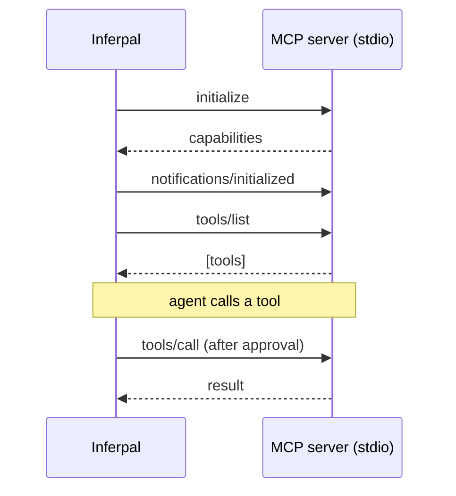

# MCP — Model Context Protocol

Inferpal can connect to any **stdio or Streamable HTTP [MCP](https://modelcontextprotocol.io)
server** and expose its tools to the agent — the same servers used by Claude Desktop and Continue
(filesystem, GitHub, databases, and hundreds more).

## Enabling MCP

1. **Settings → MCP** — enable MCP servers.
2. Paste a server map in the Claude Desktop / Continue format:

```json
{
  "filesystem": {
    "command": "npx",
    "args": ["-y", "@modelcontextprotocol/server-filesystem", "C:\\dev"],
    "env": {}
  },
  "remote": {
    "url": "https://mcp.example.com/mcp",
    "headers": { "Authorization": "Bearer ${MY_TOKEN}" }
  }
}
```

   A server with a `command` uses the **stdio** transport; one with a `url` uses **Streamable HTTP**.
   Header values support `${ENV_VAR}` expansion (resolved at connection time), so tokens stay out of
   the stored config. The list editor handles both: tick **“HTTP server”** to switch a row between
   the command/args/env fields and the url/headers fields (or edit the raw map in the **JSON** view).

3. Save. Each server is spawned and its status is shown (e.g. `✓ filesystem — 11 tools`).

## How it works

- On startup (or after saving settings), each server is spawned and its tools are discovered
  via `tools/list`.
- Discovered tools appear to the agent as `mcp__<server>__<tool>` and are merged into the
  tool list alongside built-ins and custom shell tools (built-ins take priority on a name
  clash).
- The client is a **home-grown JSON-RPC 2.0** implementation with **zero extra NuGet
  dependencies** — it performs the `initialize` handshake, then `tools/list` / `tools/call`.
  Two transports implement the same `IMcpClient` contract: **stdio** (over the server process's
  stdin/stdout) and **Streamable HTTP** (POST to a single endpoint; the server replies with
  `application/json` or a `text/event-stream`, and the `Mcp-Session-Id` header is echoed on every
  request).



## Approval

Every MCP tool call is gated by the same 3-way prompt as the built-in tools:

> **Allow once** · **Always allow this tool** · **Cancel**

The "always" grant is **scoped to the session and never persisted** — MCP servers run
arbitrary external code, so the choice is deliberately not remembered across sessions. See
[Tools → Approval model](tools.md#approval-model).

## Scope & limits

> [!NOTE]
> HTTP auth supports **static headers** (bearer token / custom headers, with `${ENV_VAR}` expansion)
> **and OAuth 2.1** (see below). An expired HTTP session (a `404` on a request carrying an
> `Mcp-Session-Id`) is handled transparently: the client re-runs `initialize` and replays the request.

## OAuth 2.1 (remote servers)

When a Streamable HTTP server returns **401**, it requires OAuth. Inferpal implements the MCP
authorization spec (2025-06-18): discovery of the authorization server (RFC 9728 → RFC 8414),
**PKCE**, the **`resource`** indicator (RFC 8707), and **dynamic client registration** (RFC 7591)
when the server supports it.

- The server's row shows **🔒 authorization required** with an **Authorize…** button. Clicking it
  opens your browser to the provider's consent page and captures the redirect on a temporary loopback
  listener (`http://127.0.0.1:<port>/callback`). On success the tokens are stored and the server
  reconnects.
- Tokens are stored **encrypted with Windows DPAPI** (per-user) in `%AppData%/Inferpal/mcp-oauth.dat`
  — never in the config JSON. Access tokens are refreshed automatically; you only re-authorize when
  the refresh token is rejected.
- If the authorization server does **not** support dynamic registration, set a pre-registered client
  in the server's `oauth` block:

```json
"remote": {
  "url": "https://mcp.example.com/mcp",
  "oauth": { "client_id": "your-client-id", "scopes": ["mcp.read", "mcp.write"] }
}
```

Servers that advertise the `tools.listChanged` capability are re-discovered **live**: when one
sends a `notifications/tools/list_changed`, Inferpal re-runs `tools/list` for that server and
republishes the merged tool set — no settings save needed. This works on **both transports**: stdio
servers signal it on their stdout stream, HTTP servers on the optional server→client GET SSE stream
(opened automatically after the handshake). Servers without that capability are refreshed when you
save settings (or on startup).

If a **stdio** server process **dies mid-session**, its tools are dropped immediately and Inferpal
auto-reconnects with backoff (1s → 2s → 5s → 10s → 30s). On success the tools reappear; if every
attempt fails the server is left disconnected (with an error in its status) until the next save.
(HTTP has no equivalent process-death signal; an ended GET stream is treated as a normal rotation
and simply re-opened.)
