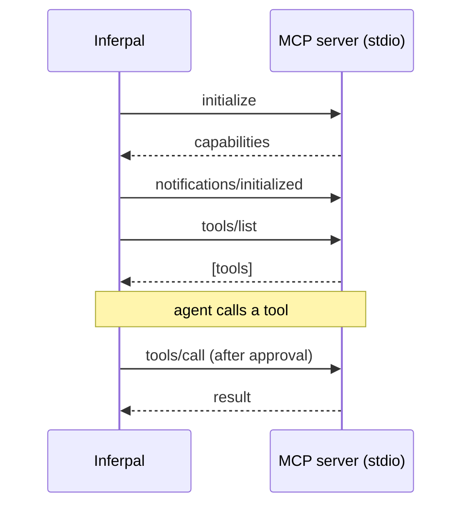

# MCP — Model Context Protocol

Inferpal can connect to any **stdio or Streamable HTTP [MCP](https://modelcontextprotocol.io)
server** and expose its tools to the agent — the same servers used by Claude Desktop and Continue
(filesystem, GitHub, databases, and hundreds more).

## Enabling MCP

1. **Settings → Tools and MCP servers** — tick *Use MCP servers*.
2. Paste a server map in the Claude Desktop / Continue format:

```json
{
  "filesystem": {
    "command": "npx",
    "args": ["-y", "@modelcontextprotocol/server-filesystem", "C:\\dev"],
    "env": {}
  },
  "remote": {
    "url": "https://mcp.example.com/mcp",
    "headers": { "Authorization": "Bearer ${MY_TOKEN}" }
  }
}
```

   A server with a `command` uses the **stdio** transport; one with a `url` uses **Streamable HTTP**.
   `"command": "npx"` (or `"npm"`) works as written on every OS: on Windows, where both are batch
   scripts, Inferpal runs them through the `node.exe` installed beside them — never through `cmd.exe`,
   so no `"cmd", "/c"` wrapper is needed.
   Header values support `${ENV_VAR}` expansion (resolved at connection time), so tokens stay out of
   the stored config. The list editor handles both: tick **“HTTP server”** to switch a server between
   the command/arguments/environment fields (one argument per line) and the url/headers fields, or
   edit the raw map with **Edit as JSON**.

3. Save. Each server is started and shown as a card: *Connected · 11 tools*, *Needs sign-in*, *Off*,
   or *Did not start* — then with the server's own error message under it (what it wrote before
   exiting, or why it was refused) and a **Retry** button.

## How it works

- On startup (or after saving settings), each server is spawned and its tools are discovered
  via `tools/list`.
- Discovered tools appear to the agent as `mcp__<server>__<tool>` and are merged into the
  tool list alongside built-ins and custom shell tools (built-ins take priority on a name
  clash).
- The client is a **home-grown JSON-RPC 2.0** implementation with **zero extra NuGet
  dependencies** — it performs the `initialize` handshake, then `tools/list` / `tools/call`.
  Two transports implement the same `IMcpClient` contract: **stdio** (over the server process's
  stdin/stdout) and **Streamable HTTP** (POST to a single endpoint; the server replies with
  `application/json` or a `text/event-stream`, and the `Mcp-Session-Id` header is echoed on every
  request).


```mermaid
sequenceDiagram
    participant I as Inferpal
    participant S as MCP server (stdio)
    I->>S: initialize
    S-->>I: capabilities
    I->>S: notifications/initialized
    I->>S: tools/list
    S-->>I: [tools]
    Note over I,S: agent calls a tool
    I->>S: tools/call (after approval)
    S-->>I: result
```

## Approval

Every MCP tool call is gated by the same 3-way prompt as the built-in tools:

> **Allow once** · **Always allow this tool** · **Cancel**

The "always" grant is **scoped to the session and never persisted** — MCP servers run
arbitrary external code, so the choice is deliberately not remembered across sessions. See
[Tools → Approval model](tools.md#approval-model).

## Servers your repository declares

The MCP servers a repository declares for other tools start beside yours — once you agree:

| File | Written for | Root key |
|---|---|---|
| `.vscode/mcp.json` | VS Code (with its `inputs`) | `servers` |
| `.mcp.json` | Claude Code, VS Code's portable format | `mcpServers` |
| `.vs/mcp.json` | Visual Studio | `servers` |
| `.cursor/mcp.json` | Cursor | `mcpServers` |
| `.roo/mcp.json` | Roo Code | `mcpServers` |
| `.continue/mcpServers/*.yaml` | Continue (a list of named servers) | `mcpServers` |

- **Nothing runs before you agree.** A repository's server runs a program the repository chose, so it is asked about
  first — the server, its file and the command it runs — **even with approvals switched off and under an `allow`
  rule**. Your agreement is kept for that repository and that exact definition: change one argument and you are asked
  again. A declined server is asked about again at the next start.
- **Variables** are replaced the way each tool does: `${workspaceFolder}`, `${workspaceFolderBasename}`,
  `${userHome}`, `${env:NAME}`, `${NAME}` and `${NAME:-default}`, `${input:id}` — asked once per session, in VS
  Code's input box (hidden when the input is a `password`) or Visual Studio's input prompt (which cannot hide what is
  typed, and says so). A variable nothing fills (`${{ secrets.X }}`, an unset variable) is named and the server does
  not start on an empty value.
- A repository's server **runs in the repository's root**, or in the `cwd` it declares, resolved against that root.
- A server you configured yourself keeps its name: the repository's server of the same name does not start, and the
  status says why. So does a file that cannot be read, with its reason.

## Scope & limits

> [!NOTE]
> **Tool results are forwarded as text.** Inferpal passes on `text` blocks and the text of `resource`
> blocks. A tool that answers with an image, audio, a resource link or a binary blob has that block
> **named** in the result instead of forwarded — a local text model cannot read a PNG, but "the tool
> returned an image" and "the tool returned nothing" are not the same answer, and a screenshot server
> used to read as the second.

> [!NOTE]
> HTTP auth supports **static headers** (bearer token / custom headers, with `${ENV_VAR}` expansion)
> **and OAuth 2.1** (see below). An expired HTTP session (a `404` on a request carrying an
> `Mcp-Session-Id`) is handled transparently: the client re-runs `initialize` and replays the request.

## OAuth 2.1 (remote servers)

When a Streamable HTTP server returns **401** and no credential of yours went with the request (no `Authorization`
or API-key header configured), it requires OAuth. A 401 to a request that carried your own header is the server
refusing that credential: the card shows **Failed** with the server's reason, and names a `${VAR}` the editor's
environment does not set. Inferpal implements the MCP
authorization spec (2025-06-18): discovery of the authorization server (RFC 9728 → RFC 8414),
**PKCE**, the **`resource`** indicator (RFC 8707), and **dynamic client registration** (RFC 7591)
when the server supports it.

- The server's card shows **Needs sign-in** with a **Sign in** button, in both editors. Clicking it
  opens your browser to the provider's consent page and captures the redirect on a temporary loopback
  listener (`http://127.0.0.1:<port>/callback`). On success the tokens are stored and the server
  reconnects.
- Tokens are stored **encrypted** (Windows DPAPI per user, or the editor's secret store elsewhere) in `%AppData%/Inferpal/mcp-oauth.dat`
  — never in the config JSON. Access tokens are refreshed automatically; you only re-authorize when
  the refresh token is rejected.
- If the authorization server does **not** support dynamic registration, set a pre-registered client
  in the server's `oauth` block:

```json
"remote": {
  "url": "https://mcp.example.com/mcp",
  "oauth": { "client_id": "your-client-id", "scopes": ["mcp.read", "mcp.write"] }
}
```

Servers that advertise the `tools.listChanged` capability are re-discovered **live**: when one
sends a `notifications/tools/list_changed`, Inferpal re-runs `tools/list` for that server and
republishes the merged tool set — no settings save needed. This works on **both transports**: stdio
servers signal it on their stdout stream, HTTP servers on the optional server→client GET SSE stream
(opened automatically after the handshake). Servers without that capability are refreshed when you
save settings (or on startup).

If a **stdio** server process **dies mid-session**, its tools are dropped immediately and Inferpal
auto-reconnects with backoff (1s → 2s → 5s → 10s → 30s). On success the tools reappear; if every
attempt fails the server is left disconnected until the next save, its status naming why the last
attempt failed. The death itself is named in `/diagnostics` — exit code and stderr, once per cause —
so a server that crashes on every call and is restarted each time still leaves a trace.

**When a server does not start**, `/diagnostics` says why in the server's own words: a stdio server
that exits is reported with its exit code and the first and last lines it wrote on stderr (where a
server says it is missing a token, a path or a package), and an HTTP server that refuses is reported
with the reason in its response, not only the status code.
(HTTP has no equivalent process-death signal; an ended GET stream is treated as a normal rotation
and simply re-opened.)
