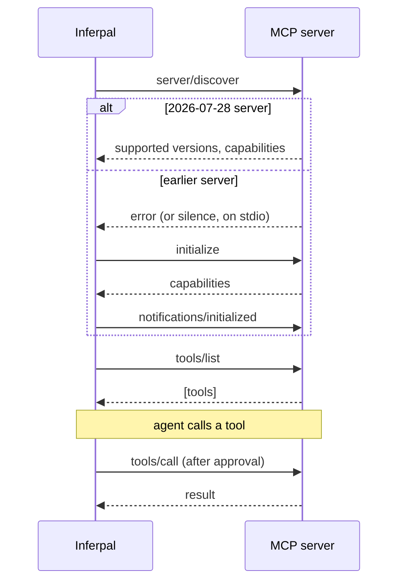

# MCP — Model Context Protocol

Inferpal can connect to any **stdio or Streamable HTTP [MCP](https://modelcontextprotocol.io)
server** and expose its tools to the agent — the same servers used by Claude Desktop and Continue
(filesystem, GitHub, databases, and hundreds more).

## Enabling MCP

1. **Settings → Tools and MCP servers** — tick *Use MCP servers*.
2. Paste a server map in the Claude Desktop / Continue format:

```json
{
  "filesystem": {
    "command": "npx",
    "args": ["-y", "@modelcontextprotocol/server-filesystem", "C:\\dev"],
    "env": {}
  },
  "remote": {
    "url": "https://mcp.example.com/mcp",
    "headers": { "Authorization": "Bearer ${MY_TOKEN}" }
  }
}
```

   A server with a `command` uses the **stdio** transport; one with a `url` uses **Streamable HTTP**.
   A stdio server starts in the folder its `"cwd"` names (`~` is your home folder), else in the editor's own.
   `"command": "npx"` (or `"npm"`) works as written on every OS: on Windows, where both are batch
   scripts, Inferpal runs them through the `node.exe` installed beside them — never through `cmd.exe`,
   so no `"cmd", "/c"` wrapper is needed.
   Header values support `${ENV_VAR}` expansion (resolved at connection time), so tokens stay out of
   the stored config. The list editor handles both: tick **“HTTP server”** to switch a server between
   the command/arguments/environment fields (one argument per line) and the url/headers fields, or
   edit the raw map with **Edit as JSON**.

3. Save. Each server is started and shown as a card: *Connected · 11 tools*, *Needs sign-in*, *Off*,
   or *Did not start* — then with the server's own error message under it (what it wrote before
   exiting, or why it was refused) and a **Retry** button.

## How it works

- On startup (or after saving settings), each server is spawned and its tools are discovered
  via `tools/list`.
- Discovered tools appear to the agent as `mcp__<server>__<tool>` and are merged into the
  tool list alongside built-ins and custom shell tools (built-ins take priority on a name
  clash).
- The client is a **home-grown JSON-RPC 2.0** implementation with **zero extra NuGet
  dependencies**, then `tools/list` / `tools/call`. Two transports implement the same `IMcpClient`
  contract: **stdio** (over the server process's stdin/stdout) and **Streamable HTTP** (POST to a
  single endpoint; the server replies with `application/json` or a `text/event-stream`).
- It speaks **both eras of the protocol**. It opens with `server/discover`: a server of the
  **2026-07-28** revision answers it, and is then spoken to without a handshake — every request
  carries its version and the client's identity in `_meta`, and over HTTP the `MCP-Protocol-Version`,
  `Mcp-Method`, `Mcp-Name` and the tool's own `Mcp-Param-*` headers. A server of an earlier revision
  refuses that request (or, on stdio, stays silent for 3 seconds), and gets the `initialize`
  handshake it has always received — over HTTP, with its `Mcp-Session-Id` echoed on every request.


```mermaid
sequenceDiagram
    participant I as Inferpal
    participant S as MCP server
    I->>S: server/discover
    alt 2026-07-28 server
        S-->>I: supported versions, capabilities
    else earlier server
        S-->>I: error (or silence, on stdio)
        I->>S: initialize
        S-->>I: capabilities
        I->>S: notifications/initialized
    end
    I->>S: tools/list
    S-->>I: [tools]
    Note over I,S: agent calls a tool
    I->>S: tools/call (after approval)
    S-->>I: result
```

## Large tool sets: on demand

Every tool's definition is sent with every request, before the first word of the answer. An editor's own server can
weigh more than the whole window: Rider's has 93 tools, about 49,000 tokens as Inferpal counts them, more than a 32K
window. So the MCP tools are declared while they take at most **a tenth of the context window in use** (32,768 tokens
are assumed while the window is not known yet); beyond that, servers go **on demand** one at a time, the heaviest
first, until the rest fits — a small server stays declared beside a large one.

- Their tools are not sent. The model gets one more tool, `tool_search`, whose description names the servers on demand
  and their tools (within the same tenth of the window; a server whose names do not fit is named with its count). It
  loads tools by name (`select:mcp__rider__get_run_configurations`, or the name without its prefix when only one server
  has it) or by keywords — the closest matches, the others named so they can be selected — at most five per call, each
  returned with its schema. A tool called directly by its name, as a structured call or written as text, is loaded once
  it has run.
- A loaded tool is declared from the next request on, **after every other tool, in the order it was loaded**, and never
  moves: a server that reuses its cache reads the request again only from the first change — once per load, never once
  per question. It stays loaded for the rest of the conversation; a new conversation starts without it.
- **X-Ray** says which tools wait: "93 MCP tools on demand — not sent until loaded by tool_search: rider (93)".
- Plan mode and background tasks send no MCP tool at all, so `tool_search` is not offered there.

## Approval

Every MCP tool call is gated by the same 3-way prompt as the built-in tools:

> **Allow once** · **Always allow this tool** · **Cancel**

The "always" grant is **scoped to the session and never persisted** — MCP servers run
arbitrary external code, so the choice is deliberately not remembered across sessions. See
[Tools → Approval model](tools.md#approval-model).

## Servers your repository declares

The MCP servers a repository declares for other tools start beside yours — once you agree:

| File | Written for | Root key |
|---|---|---|
| `.vscode/mcp.json` | VS Code (with its `inputs`) | `servers` |
| `.mcp.json` | Claude Code, VS Code's portable format | `mcpServers` |
| `.vs/mcp.json` | Visual Studio | `servers` |
| `.cursor/mcp.json` | Cursor | `mcpServers` |
| `.roo/mcp.json` | Roo Code | `mcpServers` |
| `.continue/mcpServers/*.yaml` | Continue (a list of named servers) | `mcpServers` |

- **Nothing runs before you agree.** A repository's server runs a program the repository chose, so it is asked about
  first — the server, its file and the command it runs — **even with approvals switched off and under an `allow`
  rule**. Your agreement is kept for that repository and that exact definition: change one argument and you are asked
  again. A declined server is asked about again at the next start.
- **Your agreement also covers the repository's files the server runs.** Inferpal looks for every file and folder of
  the repository the definition names — in its command, its arguments or its environment, variables replaced, and in
  the `package.json` script that `npm run` (or `pnpm`, `yarn`, `bun`) starts — and covers each named file with the
  folder it lives in, the `cwd` it declares, and the manifest its runner reads (`package.json`, `pyproject.toml`, a
  `.csproj`…). A name the runtime completes counts too: `node tools/mcp/server` covers `tools/mcp`, and
  `python -m tools.mcp.server` covers `tools/mcp/server.py`. In a git repository a folder means the files git
  **tracks** there — what a pull changes, the files of a submodule included — so what your machine writes beside the
  code (build output, installed dependencies, caches, logs, a database) never asks again; outside git, those folders
  are read whole, build output, dependency and cache folders excepted — and so is a folder git tracks nothing in (a
  workspace inside another repository's work tree, a name written in another case than git's). A file the definition
  names is always covered, even one git does not track: a database named in its arguments asks again when it
  changes. When one of these files changes, the server is asked about again. They are
  checked once more just before the server starts, and before Inferpal restarts a server that exited: one whose files
  changed stays stopped, and its status names the file.
  - A link that leads out of the repository is never followed: the agreement covers where it points, not what lies
    there.
  - Not covered — the command on the card is what you agree to there: what the program fetches or finds on its own
    (an `npx` package, a module on its own path), the files a build pulls in from elsewhere, and the imports of a script
    at the repository's root, which covers that file alone rather than the whole repository.
  - A server whose folders hold more than 20,000 files, or whose files cannot be read, cannot be covered: it is asked
    about at every start, its status and `/diagnostics` say why, and it is not restarted after it stops.
  - An agreement given by an earlier version of Inferpal to a server that runs repository files is asked again once.
    The editor still on that version keeps its own agreement, so the two editors do not undo each other's.
- **Variables** are replaced the way each tool does: `${workspaceFolder}`, `${workspaceFolderBasename}`,
  `${userHome}`, `${env:NAME}`, `${NAME}` and `${NAME:-default}`, `${input:id}` — asked once per session, in VS
  Code's input box (hidden when the input is a `password`) or Visual Studio's input prompt (which cannot hide what is
  typed, and says so). A variable nothing fills (`${{ secrets.X }}`, an unset variable) is named and the server does
  not start on an empty value.
- A repository's server **runs in the repository's root**, or in the `cwd` it declares, resolved against that root.
- Continue's remote server sends its `requestOptions.headers`, and its `apiKey` as `Authorization: Bearer …`. A
  server that declares the older SSE transport (`"type": "sse"`) is tried with Streamable HTTP, which many such servers
  also serve; when it does not, its error says that SSE is not supported. A server that declares WebSocket is not
  started — nothing in Inferpal speaks it — and its status says so; `/import` leaves it out by name.
- A server you configured yourself keeps its name: the repository's server of the same name does not start, and the
  status says why. So does a file that cannot be read, with its reason.
- A repository's server you agreed to — and a server your ACP client passes — has a card of its own in the settings,
  under your list, with its state and its cause. It cannot be edited from there (its definition is not yours), but an
  HTTP server that asks for a sign-in is signed in to there, with the same **Sign in** button as yours.

## Scope & limits

> [!NOTE]
> **Tool results are forwarded as text.** Inferpal passes on `text` blocks and the text of `resource`
> blocks. A tool that answers with an image, audio, a resource link or a binary blob has that block
> **named** in the result instead of forwarded — a local text model cannot read a PNG, but "the tool
> returned an image" and "the tool returned nothing" are not the same answer, and a screenshot server
> used to read as the second.

> [!NOTE]
> **A structured argument is written out in full.** A tool schema may describe an argument once and refer to it
> (`$defs` and `$ref` — how the Python SDK writes every nested model). Ollama keeps no `$ref`, so such an argument
> would reach the model with no type: Inferpal inlines the schema's local references before offering the tool. A
> reference to another document is left as written and never fetched.

> [!NOTE]
> **Inferpal answers no request from the server.** It declares no elicitation, sampling or roots, so a 2026-07-28
> server may not ask for one; a tool that still does is reported to the model as *needing input Inferpal does not
> provide*, never as an empty result. A tool whose `x-mcp-header` annotation breaks the specification's rules is left
> out of the list, as the specification requires, and `/diagnostics` names it.

> [!NOTE]
> HTTP auth supports **static headers** (bearer token / custom headers, with `${ENV_VAR}` expansion)
> **and OAuth 2.1** (see below). With a server of an earlier revision, an expired HTTP session (a `404` on a request
> carrying an `Mcp-Session-Id`) is handled transparently: the client re-runs `initialize` and replays the request.

## OAuth 2.1 (remote servers)

When a Streamable HTTP server returns **401** and no credential of yours went with the request (no `Authorization`
or API-key header configured), it requires OAuth. A 401 to a request that carried your own header is the server
refusing that credential: the card shows **Failed** with the server's reason, and names a `${VAR}` the editor's
environment does not set. Inferpal implements the MCP
authorization spec (2026-07-28): discovery of the authorization server (RFC 9728 → RFC 8414 or OpenID Connect
discovery, an issuer with a path included — Entra, Keycloak, Okta), **PKCE**, the **`resource`** indicator
(RFC 8707), and **dynamic client registration** (RFC 7591) when the server supports it.

- **The scopes asked for** are the ones in the server's `oauth` block; without them, the ones the MCP server's own
  metadata names; without those, none — never every scope the authorization server lists, which a shared identity
  provider would refuse or ask you to consent to in full. When no metadata document is found, Inferpal tries the
  conventional `/authorize` and `/token` at the authorization server's origin and notes it in `/diagnostics`.

- **The answer is checked before the code is used**: when the authorization server names itself in its answer
  (`iss`, RFC 9207), the name must be the one its metadata gives, exactly; one that advertises it and leaves it out is
  refused too. An answer from another authorization server is not used and its error is not shown — that is how a
  mix-up attack would deliver someone else's code.
- A client registered with one authorization server is reused only with that one: if the server moves to another,
  Inferpal registers again.

- The server's card shows **Needs sign-in** with a **Sign in** button, in both editors. Clicking it
  opens your browser to the provider's consent page and captures the redirect on a temporary loopback
  listener (`http://127.0.0.1:<port>/callback`). On success the tokens are stored and the server
  reconnects. In VS Code the page opens through VS Code — on your machine, with the redirect forwarded, also when the
  window is connected to a remote machine (SSH, WSL, a container). If no browser can be opened, the sign-in says so at
  once instead of waiting for a redirect that cannot come.
- Tokens are stored **encrypted** (Windows DPAPI per user, or the editor's secret store elsewhere) in `%AppData%/Inferpal/mcp-oauth.dat`
  — never in the config JSON. Access tokens are refreshed automatically; you only re-authorize when
  the refresh token is rejected. A provider that cannot answer at that moment (down, busy, unreachable) does not reject
  it: the server's status says the sign-in could not be renewed, and the next call tries again. Visual Studio and VS
  Code share the sign-in, so a token one of them renewed is used by the other.
- If the authorization server does **not** support dynamic registration, set a pre-registered client
  in the server's `oauth` block:

```json
"remote": {
  "url": "https://mcp.example.com/mcp",
  "oauth": { "client_id": "your-client-id", "scopes": ["mcp.read", "mcp.write"] }
}
```

Servers that advertise the `tools.listChanged` capability are re-discovered **live**: when one
sends a `notifications/tools/list_changed`, Inferpal re-runs `tools/list` for that server and
republishes the merged tool set — no settings save needed. This works on **both transports**: stdio
servers signal it on their stdout stream, HTTP servers on the optional server→client GET SSE stream
(opened automatically after the handshake). A 2026-07-28 server sends it only on a subscription asked
for, so Inferpal opens one (`subscriptions/listen`) when the server announces the capability. Servers
without that capability are refreshed when you save settings (or on startup).

If a **stdio** server process **dies mid-session**, its tools are dropped immediately and Inferpal
auto-reconnects with backoff (1s → 2s → 5s → 10s → 30s). On success the tools reappear; if every
attempt fails the server is left disconnected until the next save, its status naming why the last
attempt failed. The death itself is named in `/diagnostics` — exit code and stderr, once per cause —
so a server that crashes on every call and is restarted each time still leaves a trace.

**When a server does not start**, `/diagnostics` says why in the server's own words: a stdio server
that exits is reported with its exit code and the first and last lines it wrote on stderr (where a
server says it is missing a token, a path or a package), and an HTTP server that refuses is reported
with the reason in its response, not only the status code.
(HTTP has no equivalent process-death signal; an ended GET stream is treated as a normal rotation
and simply re-opened.)
