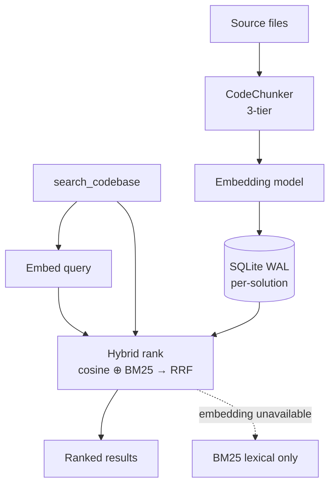

# Search & Indexing

Inferpal builds two semantic indexes that share one embedding engine: a **per-solution code
index** (`search_codebase`) and a **global external-documentation index** (`search_docs`,
the `@Docs` feature).

## Semantic codebase search (RAG)

The agent (and you, via `/search-code`) can find code by describing it in plain language:

```
search_codebase "authentication token validation"
search_codebase "database retry with exponential backoff"
```

Results are ranked by **hybrid search** — semantic cosine similarity *and* lexical BM25, fused
with Reciprocal Rank Fusion — and include file paths and line numbers. The lexical side catches
exact identifiers, symbol names, and file names that weak local embeddings tend to dilute.

### How it works



- **3-tier chunking** (`CodeChunker`): Roslyn for C# (syntax tree + XML docs), an optional
  LSP tier for TS/JS/Python/Go/Rust (`lspEnabled`), and a regex fallback. Target ~500 tokens
  per chunk with ~100 tokens overlap.
- **Vector store** (`RagDatabase`): SQLite WAL, one database per solution under
  `%AppData%/Inferpal/rag/{hash}.db`. In-memory map for O(1) per-file access.
- **Hybrid ranking**: the vector side keeps chunks above `ragSimilarityThreshold` (default
  `0.20`); the lexical side scores chunks with in-memory BM25 (code-aware tokenizer that splits
  camelCase / snake_case / acronyms and keeps whole identifiers). The two rankings are fused
  with **Reciprocal Rank Fusion**, returning `ragTopK` chunks (default `5`). When embeddings are
  unavailable, lexical BM25 alone is used.
- **Resilience**: an embedding **circuit breaker** opens after repeated failures and recovers
  automatically.
- **Shadow pre-warm**: while you type, results are pre-fetched (debounced) so the tool
  responds instantly. **Smart Auto-attach** suggests the top-2 relevant files as dismissable
  chips before you send.
- **Auto-context** (`ragAutoContextEnabled`, default on): each code-related turn silently
  injects the most relevant chunks for your message into the prompt — budget-capped and
  deduplicated against anything already attached. Reuses the warm shadow result when available,
  so it is usually free; guarantees per-turn context even when you send before the chips fire.

### Supported file types

`.cs` `.ts` `.tsx` `.js` `.jsx` `.py` `.go` `.java` `.cpp` `.c` `.h` `.hpp` `.rs` `.fs`
`.razor` `.vue`

### Indexing lifecycle

- Indexing runs in the background and **persists** across restarts.
- A `FileSystemWatcher` re-indexes changed files with a 5 s debounce.
- `/index` starts/restarts indexing; `/index rebuild` forces a full rebuild.
- Indexing automatically **pauses while a chat/agent request runs** and resumes right after —
  the interactive model always gets the GPU first (see
  [Architecture → GPU scheduling](architecture.md#gpu-scheduling)).

### Settings

`ragEnabled`, `ragAutoContextEnabled`, `ragEmbeddingModel` (default `nomic-embed-text`),
`ragTopK`, `ragSimilarityThreshold`, `lspEnabled` — see
[Configuration](configuration.md#rag--semantic-index).

## External documentation (@Docs)

Index an external documentation site so the agent answers library/framework questions from
the docs themselves, citing the source page and URL.

```
/docs add https://react.dev/learn "React"
/docs list
/docs remove react
/docs reindex
```

- **Crawl**: `/docs add` crawls the site **same-domain** (following links under the start
  URL's path), capped at 50 pages / depth 3, reusing the HTML-to-text converter and the same
  SSRF guard as `fetch_url`.
- **Chunk & embed**: each page is sliced into ~500-token windows and embedded in the
  background (progress shown as chat bubbles).
- **Storage**: a single **global** SQLite database at `%AppData%/Inferpal/docs/docs.db`, so a
  site you index once is available across every solution.
- **Retrieve**: the `search_docs` tool runs cosine search (keyword fallback) and cites the
  page title and URL.

Embeddings reuse the configured `ragEmbeddingModel`. `@Docs` has no Settings section — it is
managed entirely through `/docs` (sources persist in `docSitesJson`).
